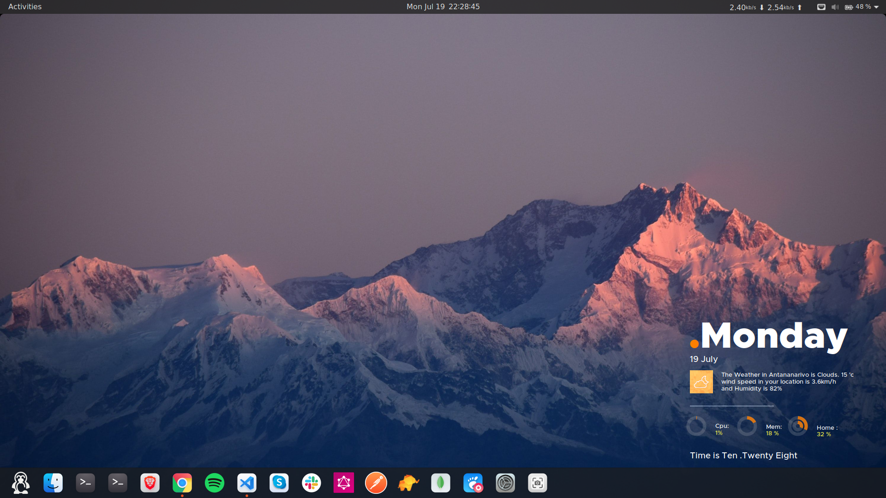

# Custom Ubuntu Desktop v20.04 with Gnome v3.36.5

 

## Preview

 
 

## Move “Show Applications” right to left of the Dock

`gsettings set org.gnome.shell.extensions.dash-to-dock show-apps-at-top true`

## Change “Show Applications” Grid Icon

[Tuto link](https://ubuntuhandbook.org/index.php/2019/01/change-show-applications-grid-icon-ubuntu-18-04/)

## GTK3/4 Theme

[McMojave](https://www.pling.com/s/Gnome/p/1275087) or [Sweet](https://www.pling.com/s/Gnome/p/1253385) or other.

## Gnome Shell Theme

[Black Maia](https://www.pling.com/s/Gnome/p/1201366)

## Grub Theme

[Grub 2 themes](https://github.com/vinceliuice/grub2-themes) or [CyberRe](https://www.pling.com/s/Gnome/p/1420727) or [BigSur GRUB Theme](https://www.pling.com/s/Gnome/p/1443844)

## Color Scheme for Gnome Terminal

[Gogh](https://mayccoll.github.io/Gogh/)

## Conky Setup

1. Install packages with `sudo apt install conky-all jq`

2. Install all fonts in `conky-fonts` folder
3. Copy `.conky` folder to your home directory with `cp -r .conky/ ~`

   If you want change your city location, change your `city_id` in `.conky/Antares/scripts/weather.sh`

4. Run conky on startup

   In `conky.sh.desktop`, change `Exec=/home/eric/.conky/start_conky.sh` to `Exec=/home/your-user-name/.conky/start_conky.sh`

   Copy `conky.sh.desktop` to `~/.config/autostart` with `cp conky.sh.desktop ~/.config/autostart`

   Now if you start your PC, conky start automatically.

5. Run conky with `~/.conky/start_conky.sh`

## Global menu for Gnome

[Fildem](https://github.com/gonzaarcr/Fildem)
